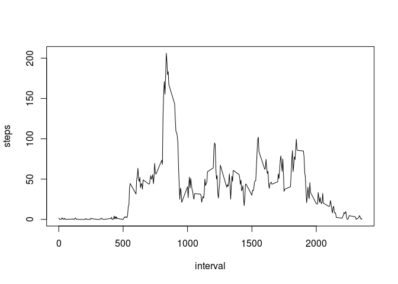

# Reproducible Research: Peer Assessment 1


## Loading and preprocessing the data

Load the data into an R data frame:


```r
activity <- read.csv('activity.csv')
library(dplyr)
```

```
## 
## Attaching package: 'dplyr'
## 
## The following objects are masked from 'package:stats':
## 
##     filter, lag
## 
## The following objects are masked from 'package:base':
## 
##     intersect, setdiff, setequal, union
```


## What is mean total number of steps taken per day?

Plot of total steps per day:


```r
steps <- group_by(activity, date) %>% summarize(total.steps = sum(steps))
hist(steps$total.steps, plot=TRUE)
```

 

Next, calculate the mean and median for steps per day.

Mean:

```r
mean(steps$total.steps, na.rm=TRUE)
```

```
## [1] 10766.19
```
Median:

```r
median(steps$total.steps, na.rm=TRUE)
```

```
## [1] 10765
```


## What is the average daily activity pattern?

First, construct a basic line plot of average steps by interval:


```r
daily.pattern <- group_by(activity, interval) %>% summarize(steps=mean(steps, na.rm=TRUE))
plot(daily.pattern,type="l")
```

 

Next, determine the interval with the highest number of steps, averaged across all days:


```r
max.steps <- max(daily.pattern$steps)
max.interval <- filter(daily.pattern, steps==max.steps)
max.interval
```

```
## Source: local data frame [1 x 2]
## 
##   interval    steps
##      (int)    (dbl)
## 1      835 206.1698
```

## Imputing missing values

First, calculate number of missing values (NA's) in the data.


```r
sum(is.na(activity$steps))
```

```
## [1] 2304
```

We will use the basic suggested strategy of taking the mean of a given interval and using that value to  
fill in gaps wherever that interval's value is missing (NA). First, we need a list of means for  
each interval:


```r
int.means <- group_by(activity, interval) %>% mutate(steps=mean(steps,na.rm=TRUE))
```

Then, with missing values filled in according to  
our strategy:


```r
filled <- NULL
for (i in 1:nrow(activity)) {
    if (is.na(activity[i,]$steps)) {
        filled <- rbind(filled, int.means[i,]) 
    }
    else {
        filled <- rbind(filled, activity[i,])
    }
}
head(filled)
```

```
## Source: local data frame [6 x 3]
## Groups: interval [6]
## 
##       steps       date interval
##       (dbl)     (fctr)    (int)
## 1 1.7169811 2012-10-01        0
## 2 0.3396226 2012-10-01        5
## 3 0.1320755 2012-10-01       10
## 4 0.1509434 2012-10-01       15
## 5 0.0754717 2012-10-01       20
## 6 2.0943396 2012-10-01       25
```

Now redo the earlier calculations to see if imputing NA values significantly changes the result.

Plot of total steps per day:


```r
steps <- group_by(filled, date) %>% summarize(total.steps = sum(steps))
hist(steps$total.steps, plot=TRUE)
```

 

Mean:

```r
mean(steps$total.steps, na.rm=TRUE)
```

```
## [1] 10766.19
```
Median:

```r
median(steps$total.steps, na.rm=TRUE)
```

```
## [1] 10766.19
```
## Are there differences in activity patterns between weekdays and weekends?

Using the filled data set, first add a factor column indicating whether each date is a "weekday" or "weekend."


```r
categorize.date <- function(dates) {
    dates.categorized <- vector()
    for (d in 1:length(dates)) {
        test.day <- weekdays(as.Date(dates[d]))
        if (test.day %in% c("Saturday", "Sunday")) {
            dates.categorized[d] <- "weekend"
        }
        else {
            dates.categorized[d] <- "weekday"
        }
    }
    print(levels(dates.categorized))
    return(dates.categorized)
}

filled$days <- as.factor(categorize.date(filled$date))
```

```
## NULL
```

```r
levels(filled$days)
```

```
## [1] "weekday" "weekend"
```

Next, make a panel plot comparing average steps by time interval across weekends and weekdays.


```r
library(lattice)
filled <- group_by(filled,interval,days) %>% summarize(steps=mean(steps))
xyplot(steps ~ interval | days, data=filled, type="l")
```

 

It appears that weekday activity spikes early in the day (perhaps because of morning rush hour?) but then is much less pronounced during the rest of the days. In contrast, weekends tend to have more step activity throughout the day than weekdays, but the activity starts later and is more evenly distributed throughout the afternoon.
